# VFIO Single GPU Passthrough For Gaming (Intel 13700K + RTX 4090)
My setup for passing a single GPU from my host OS to a Windows 11 virtual machine through kvm/qemu. This guide draws inspiration heavily from [Maagu Karuri vfio-single-gpu-passthrough](https://gitlab.com/Karuri/vfio) guide. I'm mainly going to cover caveats and performance optimizations that i have picked from 10s of places and personally tested in games for best performance 

## Introduction
This solution basically hands over the GPU to guest OS upon booting the VM and hands it back to the host OS upon powering off the VM. The obvious downside of this is that you can't use the host OS (at least graphically) while the guest is running. It is therefore highly recommended that you set up SSH access to your host OS just in case of issues. 
Note that this is by no means a beginner's guide. It makes the following assumptions:
1. You have hardware that supports virtualization and IOMMU.
2. You have the necessary packages for virtualizing using kvm/qemu. 
3. You have a working/running VM on kvm/qemu (or you at least know how to set one up).
Basic primer with screenshots is provided here However, [this tutorial by bryansteiner](https://github.com/bryansteiner/gpu-passthrough-tutorial) covers this process adequately. I highly recommend you look at it if you need that kind of guidance. Specifically, [this section][actual-vm-setup] explains step-by-step what you should to in virt-manager.
Note that I am running an Nvidia card with the proprietary driver, and so some settings are specific to my case e.g. GPU drivers. The same principles also apply for AMD cards, although in this case there is also [this video by risingprismtv](https://www.youtube.com/watch?v=3BxAaaRDEEw)

## 1. Enabling iommu

  

1.  Enable iommu in bios
    
2.  In `/etc/default/grub` add `intel_iommu=on irqaffinity=0,1`  
    to GRUB_CMDLINE_LINUX_DEFAULT
    > intel_iommu enables iommu for intel based systems
    
    > `irqaffinity=0,1` which prioritizes interrupt handling for whole system to be done on first core of cpu. More info in performance section 
    
3.  Run sudo update-grub or manually update grub and restart
4. Run [this](scripts/check-iommu.sh) script to check iommu groupings
	```sh
	#!/bin/bash
	shopt -s nullglob
	for g in $(find /sys/kernel/iommu_groups/* -maxdepth 0 -type d | sort -V); do
	    echo "IOMMU Group ${g##*/}:"
	    for d in $g/devices/*; do
	        echo -e "\t$(lspci -nns ${d##*/})"
	    done;
	 done;
5. We need to find iommu block for gpu we want to pass through, Looks like this for me. 
	```sh
	IOMMU Group 14:
     01:00.0 VGA compatible controller [0300]: NVIDIA Corporation AD102 [GeForce RTX 4090] [10ce:2863] (rev a1)
     01:00.1 Audio device [0403]: NVIDIA Corporation AD102 High Definition Audio Controller [10ce:22da] (rev a1)
	```
Each and every component will have to be passed to ur VM later so make sure they are sane otherwise u might need to do [ACS Override Patch](https://github.com/bryansteiner/gpu-passthrough-tutorial#----acs-override-patch-optional) 

## 2. Virtual Machine

### 2.1. Installing qemu and virt-manager

1. Install virtual machine stuff, this might differ from distro to distro, here is how to do it on arch.
	```
	# pacman -Sy qemu-desktop libvirt edk2-ovmf virt-manager swtpm
	```
	Enable and start VM service
	```
	# systemctl enable --now libvirtd 
	```
	
2. Setup default networking
	```
	# virsh net-autostart default
	```
	Enable and start VM service
	```
	# virsh net-start default
	```
	> **Note:** The default libvirt network will only be listed if the virsh command is run as root.

### 2.2. Setting up the VM
There are many ways to do this, I'm going to do fresh install, if u have a old image of win11 vm the process is almost similar minus the windows install step.

>If you want boot with a already existing block partition on your system look up the guides attached above they cover it.

#### 2.2.1 Basics
1. Run `# virt-manager`
2. Create new VM

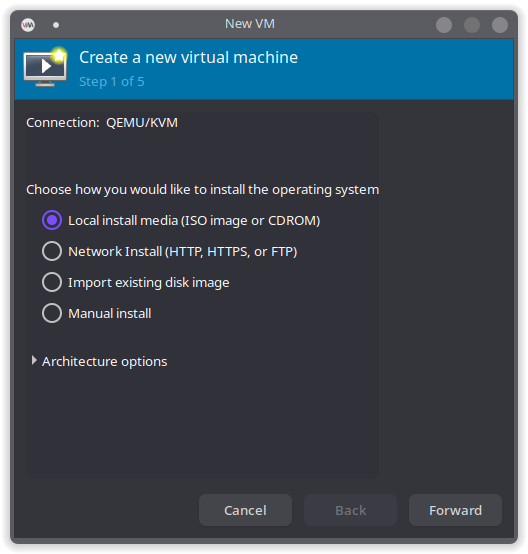
3. Local Install Media or Existing disk image (in case u already have image)

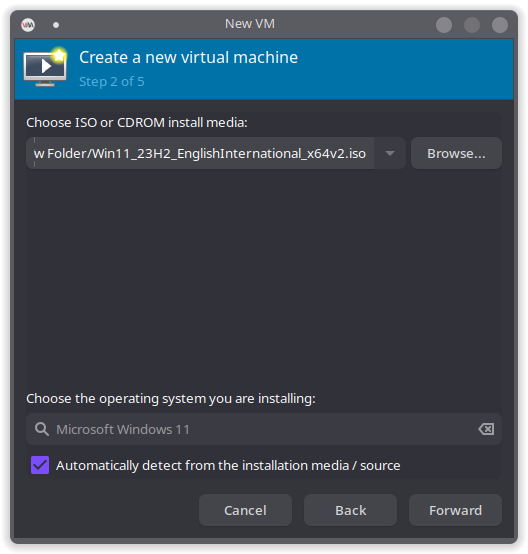

4. Allocate RAM and CPU

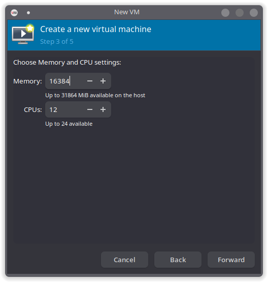

5. `[Step for Fresh Install]` Create Disk, this is where you select where to create your VM harddisk, or select already existing one. U can always resize this so no need to worry about size, i recommend 100gb for start

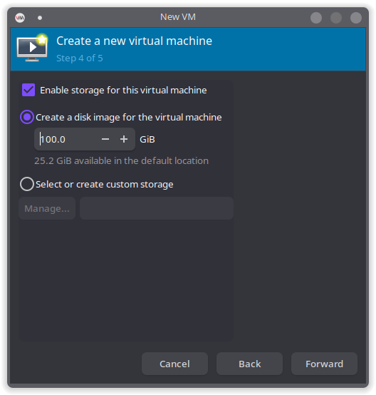

7. Name the vm win11, or anything else but keep note, this will be used later. `Check customize before install` and finish.

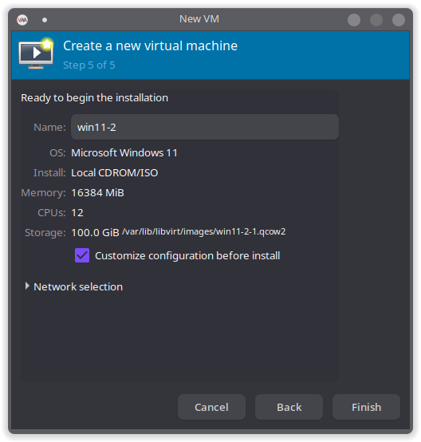

This is where things differ in my guide, DO NOT delete anything that was added yet! (talking about spice display etc etc)
Most guides tell u to start attaching your pcie devices etc from here. We will instead complete the windows instllation, make some changes and then do the rest in next section.

#### 2.2.2 Customize before install

1. Go to overview -> Chipset -> `Q35` and Firmware > `uefi ending with secboot.fd `very important for win11 `since win11 needs secure boot.`

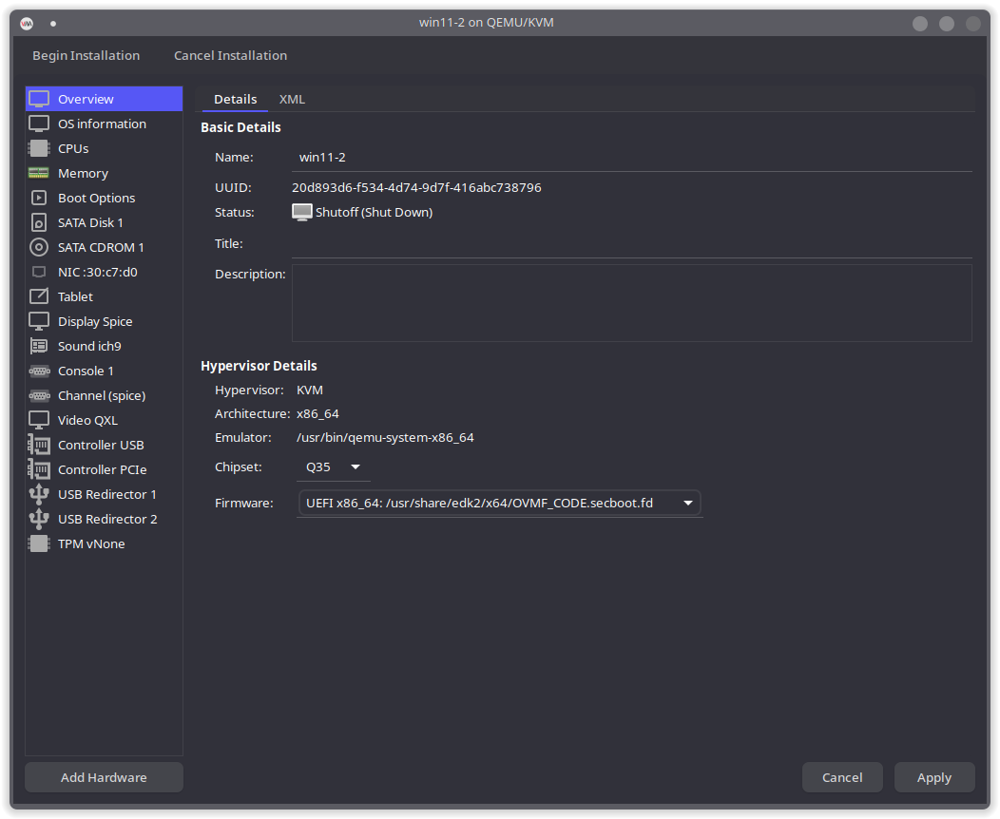

2. Replace hard disk driver for our VM with scsi, for much much better performance. `Refer arch wiki to know more`

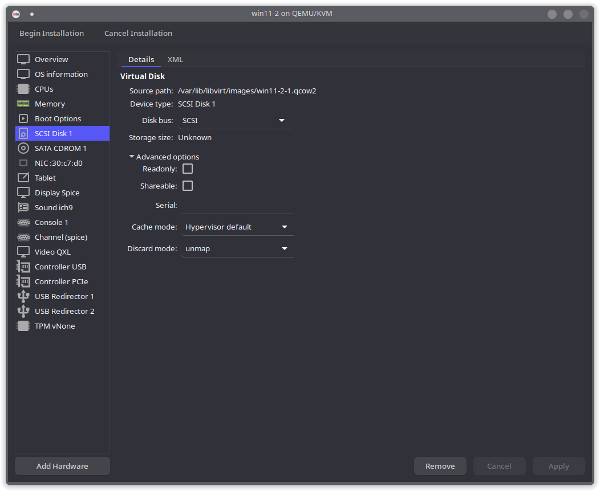

3. NIC -> Device model -> virtio `for much better networking driver`

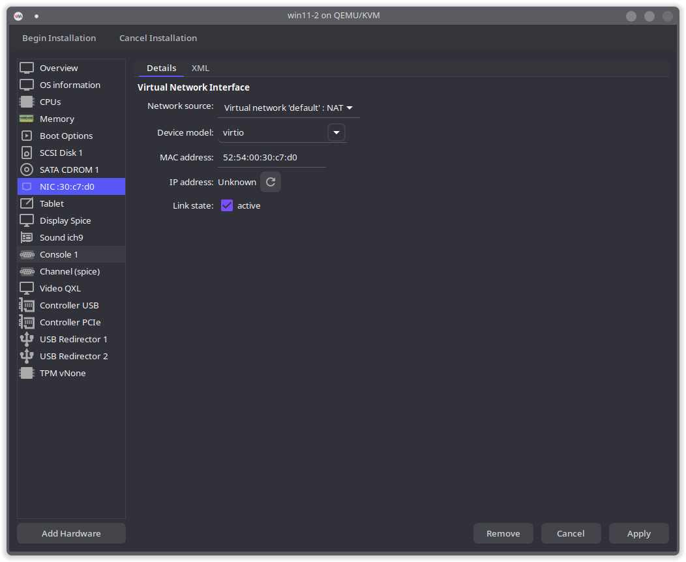

> In case u can't proceed windows setup screen without internet then set the Device model as e1000e and setup windows first. After that shutdown you can change the driver back to virtio. This might be to you important because to install virtio drivers we need to be booted inside windows first.
4. Add TPM

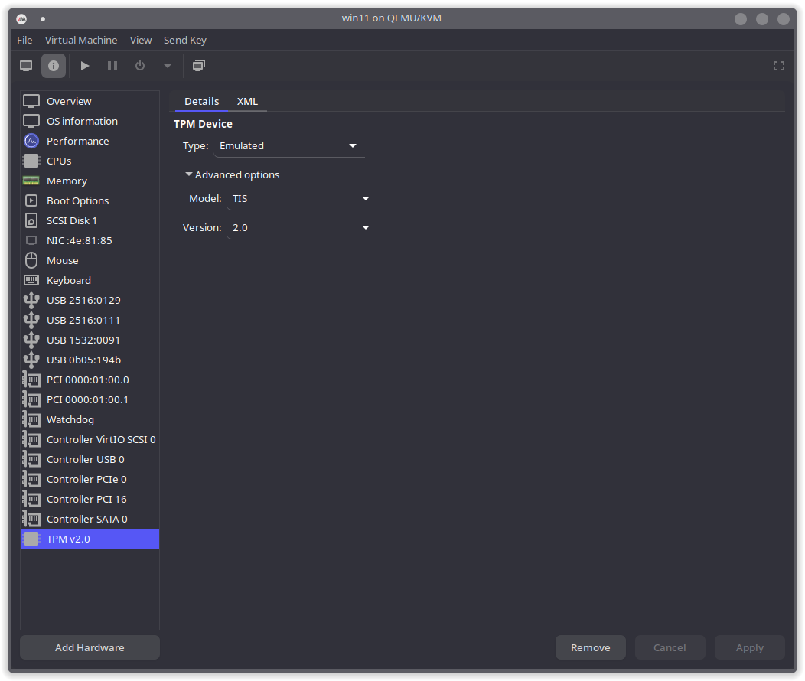

5. Mount [VirtIO driver iso](https://fedorapeople.org/groups/virt/virtio-win/direct-downloads/archive-virtio/?C=M;O=D)
	Add Hardware -> Storage -> Select custom storage -> 
  
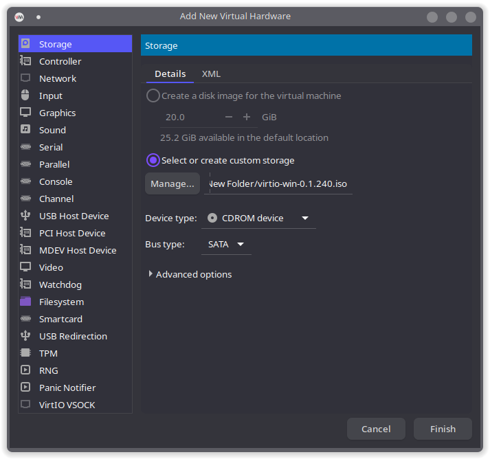
Make sure all 3 disks are checked in boot options, win11 parition disk, win11 installation disk and virtio drivers disk.

> Tip: You can come back to this wizard screen anytime u want just open VM and `View -> Details `

Now start the VM and Click Begin Installation, in windows format page, u wont see any disks, its important to click on load drivers and browse to virtio cd rom and and select voscsi/amd64 and click install, which will enable windows to communicate with SCSI controller of our disk.

#### 2.2.3 Customize after install 
> Tip: On Windows setup shift+f10 to open CMD and type `OOBE/PASSBYNRO` to skip windows setup altogether and boot directly into windows. If does not work then see above in 2.2.2 how to change Ethernet device model `which is a way to get networking to work with a emulated driver`
 
After windows is installed, open windows `device manager` and install ethernet drivers from `virtio CD-ROM` this is important for networking to be enabled and then shutdown VM.

Open customize VM window, delete extra devices, spice, console, tablet, usb redirector 1 and 2.

## 3. Passthrough Settings

Now its time to add your pcie devices like gpu and audio etc, that we previously highlighted in iommu section
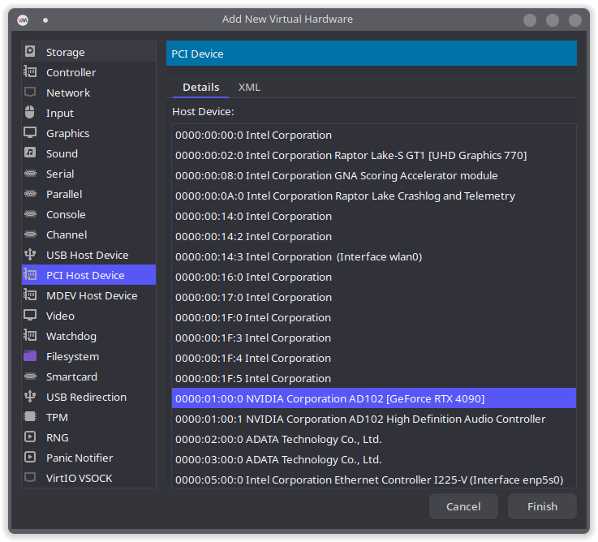
Next time we boot the VM it will directly be running on our monitor so we need to pass through our mouse and keyboard as well
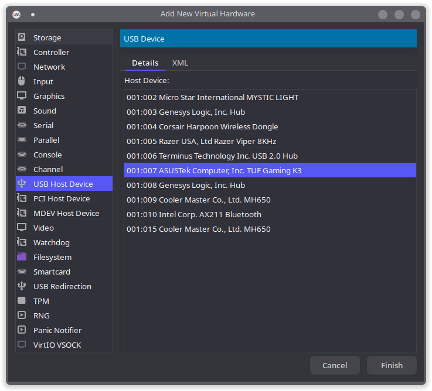

`After this dont boot the VM yet! we now need to unmount GPU drivers for passthrough to work, below i show how to setup hooks that will automatically unmount and remount the drivers when vm starts and shuts down`

### 3.1 Installing Hook Manager

We'll be utilizing [libvirt hooks](https://libvirt.org/hooks.html) to dynamically bind the vfio drivers right before the VM starts and then unbinding these drivers right after the VM terminates. To set this up we'll be following [this article from the Passthrough Post.](https://passthroughpo.st/simple-per-vm-libvirt-hooks-with-the-vfio-tools-hook-helper/)

Scripts for libvirt-hooks should be located at /etc/libvirt/hooks. If the directory doesn't exist, go ahead and create it. Once done, install the hook manager and make it executable via the following commands:

```
$ sudo wget 'https://raw.githubusercontent.com/PassthroughPOST/VFIO-Tools/master/libvirt_hooks/qemu' \
     -O /etc/libvirt/hooks/qemu
$ sudo chmod +x /etc/libvirt/hooks/qemu
```

Restart the libvirtd service for libvirtd to recognize the hook manager.

Next, we are going to have subdirectories set up in the following structure under /etc/libvirt/hooks/qemu:

```
$ tree /etc/libvirt/hooks/
/etc/libvirt/hooks/
├── qemu
└── qemu.d
    └── win11
        ├── prepare
        │   └── begin
        └── release
            └── end
```


The following are the functions for these directories
| Path | Purpose |
| ------ | ------ |
| /etc/libvirt/hooks/qemu.d/$vmname/prepare/begin/* | Resources in this folder are allocated before a VM is started |
| /etc/libvirt/hooks/qemu.d/$vmname/release/end/* | Resources in this folder are allocated after a VM has shut down |

Create the sub directories shown above, remember to replace the `win11` with name of your VM. In my case the VM name is win11.

### 3.2 Creating our Environment File
In /etc/libvirt/hooks/ create a file called kvm.conf and add the follwing enviorment varianbles:
```sh
## Virsh devices
VIRSH_GPU_VIDEO=pci_0000_01_00_0
VIRSH_GPU_AUDIO=pci_0000_01_00_1
```
Substitute the bus addresses for the devices in your GPU's IOMMU group. These are the addresses you get from running [check-iommu.sh](scripts/check-iommu.sh). Note the format we are using for the bus addresses. The prefix for the bus address (pci_0000...) is fixed. The rest of the address should be the device IDs of the PCI devices notated using underscores i.e. 06:00.0 becomes 06_00_0, 06:00.1 becomes 06_00_1 etc.

> This will act as our central config for all the hooks, the begin and end scripts are configured by the varaibles in this file.
  
### 3.3 Adding Hook Scripts
We are then going to put some scripts for allocating and deallocating the appropriate resources to our VM whenever it's started or shut down. The first script is just for holding the environmental variables that we'll be using in the actual scripts. This should prevent us from unnecessarily duplicating information and also make it easier for us to make adjustments down the line. 

#### 3.3.1 Creating Start Script
Create/copy the file [**start.sh**](/scripts/begin/start.sh) in /etc/libvirt/hooks/qemu.d/$vmname/prepare/begin/
```
echo 0 > /sys/class/vtconsole/vtcon0/bind
echo 0 > /sys/class/vtconsole/vtcon1/bind

# Unbind EFI-Framebuffer
echo efi-framebuffer.0 > /sys/bus/platform/drivers/efi-framebuffer/unbind

# Avoid a race condition
sleep 5

# Unload all Nvidia drivers
modprobe -r nvidia_drm
modprobe -r nvidia_modeset
modprobe -r drm_kms_helper
modprobe -r nvidia_uvm
modprobe -r nvidia
modprobe -r i2c_nvidia_gpu
modprobe -r drm

# Unbind the GPU from display driver
virsh nodedev-detach $VIRSH_GPU_VIDEO
virsh nodedev-detach $VIRSH_GPU_AUDIO

# Load VFIO kernel module
modprobe vfio
modprobe vfio_pci
modprobe vfio_iommu_type1
```
You may not need to unload as many nvidia drivers as I have. For example, in your case the drivers might simply be nvidia_drm, nvidia_modeset, nvidia_uvm, nvidia. If unsure, use *lsmod* to check what drivers are currently in use on your host OS e.g.

```sh
# you can run this to see kernel modules associated with nvidia
$ lsmod | grep -i nvidia
```

#### 3.3.2 Create Revert Script
This script will reload the modules after vm shutsdown so we get the linux display back.
Create the file [**revert.sh**](scripts/end/revert.sh) at /etc/libvirt/hooks/qemu.d/$vmname/release/end
```sh
#!/bin/bash
set -x

## Load the config file
source "/etc/libvirt/hooks/kvm.conf"

# Unload VFIO-PCI Kernel Driver
modprobe -r vfio_pci
modprobe -r vfio_iommu_type1
modprobe -r vfio

# Re-Bind GPU to AMD Driver
virsh nodedev-reattach $VIRSH_GPU_VIDEO
virsh nodedev-reattach $VIRSH_GPU_AUDIO


# Rebind VT consoles
echo 1 > /sys/class/vtconsole/vtcon0/bind
echo 0 > /sys/class/vtconsole/vtcon1/bind

nvidia-xconfig --query-gpu-info > /dev/null 2>&1
# Re-Bind EFI-Framebuffer
echo "efi-framebuffer.0" > /sys/bus/platform/drivers/efi-framebuffer/bind

#Load nvidia driver
modprobe nvidia_drm
modprobe nvidia_modeset
modprobe drm_kms_helper
modprobe nvidia
modprobe i2c_nvidia_gpu
modprobe drm
modprobe nvidia_uvm

# Restart Display Manager
systemctl start sddm.service
```
## 4. Run VM
Start the VM. The hook scripts defined above will be executed automatically as the guest OS starts. If things go well your display should turn black for a couple of seconds, then display the guest OS on your screen as if you directly booted into a windows pc. Hoorayyyyyy
If you instead get stuck on the black screen without logging into the guest OS monitor the logs for the VM at /var/log/libvirt/qemu/$vm_name.log (on the host OS). This is where SSH access to your host comes in handy. 
> An important step in your troubleshooting should be executing the hook scripts (start.sh and revert.sh) manually. Check for errors. [This guide by joeknock90](https://github.com/joeknock90/Single-GPU-Passthrough#black-screen-on-vm-activation) may be of assistance as you troubleshoot your issues.
> If you need to verify if the scripts worked after VM starts one way is to delete the start.sh and rever.sh scripts and remove your nvidia gpu pcie device along with input devices(MNK) this allows you to dummy boot the vm while staying in linux. This is something i say alot below and is what i mean when i say u can verify this by doing X

## 5. Optimizations 
### Setting up XML Editor
For next section we will be editing alot of XML to gain performance. There are 2 ways to edit VM XML one is through virt-manager by enabling XML Editing in Preferences the other is running `virsh edit` command in terminal. 
My preferred approach is `virsh edit` so ill be talking about that

For easier editing u may need a cli editor, my chioce is [Micro Editor](https://micro-editor.github.io/), its like code editor in terminal super helpful. 
To Change editor used by `virsh edit` add `EDITOR=Micro` in `/etc/environment` file.

Once all above is done 
```sh
# virsh edit win11 {or whatever ur VM name is}
```

### 5.1 Huge Pages
 I use huge pages to reduce memory latency. Your distro may already have huge enabled out of the box or need installation. If you're running kvm/qemu on arch or an arch-based distro the feature is already enabled. However, there are still [some additional steps](https://wiki.archlinux.org/title/KVM#Enabling_huge_pages) you'll need to take. For other distros ensure to follow the appropriate steps to enable huge pages on your host OS.
  
 Once the huge pages are set up, add the parameter *MEMORY* to [/etc/libvirt/hooks/kvm.conf](scripts/begin/alloc_hugepages.sh). 
 ```sh
 MEMORY = 12888
 ```
 The value for this parameter should be the amount of RAM, in megabytes, that you have assigned to your VM. In my case let's say I have 12 GB (12888 MB) allocated to the Windows 10 guest OS. You'll also need to add a configuration option to your VM's XML to tell it to use hugepages. Right after the settings for the memory, insert the memoryBacking lines so that your configuration looks like this:
 ```XML
 <!-- options memory unit and currentMemory are for the RAM currerty assigned to the VM. Add memoryBacking like below -->
 <memory unit="KiB">12582912</memory>
 <currentMemory unit="KiB">12582912</currentMemory>
 <memoryBacking>
 	<hugepages/>
 </memoryBacking>
 ...
 ```
 Next, add [alloc_hugepages.sh](scripts/begin/alloc_hugepages.sh) to /etc/libvirt/hooks/qemu.d/win11/prepare/begin and [dealloc_hugepages.sh](scripts/end/dealloc_hugepages.sh) to /etc/libvirt/hooks/qemu.d/win11/release/end. The first script allocates huge pages to your VM whenever it boots and the second script deallocates hugepages when the VM stops/powers off. This is an elegant solution because you only have the huge pages up when your VM needs them. 
  
 To test if the allocation happened successfully, run the following command after the VM is powered on:
 ```sh
 $ grep HugePages_Total /proc/meminfo
 ````
 This should print out the amount of huge pages reserved on the host OS. Output from my configuration looks like this:
 ```sh
 HugePages_Total:    6144
 ```
 
### 5.2 CPU Pinning

CPU pinning is an important step in optimizing CPU performance for VMs on multithreaded CPUs.

The rule of the thumb is to pass to the virtual machine cores that are as close to each other as possible so as to minimize latency. When you passthrough a virtual core you typically want to include its sibling. There isn't a one-size-fits-all solution here since the topology varies from CPU to CPU. You should therefore **NOT** copy a solution you found somewhere (mine included) and then just use it for your setup. 

There are two tools that can assist you in choosing the right cores to map. One is a quick solution that will generate a configuration for you to use and the other gives you information to enable you to pick a sensible configuration for yourself. We will go with 2nd because this is a guide for performance and automatic tools are nowhere near as good and cause more problems then solve, every cpu topology is different especially mine i7 13700k.

####  hwloc (for a more in-depth understanding)
The package *hwloc* can visually show you the topology of your CPU. Run the following command once you've installed it:
```sh
$ lstopo
```
This is the topology for my CPU as produced by the command above:
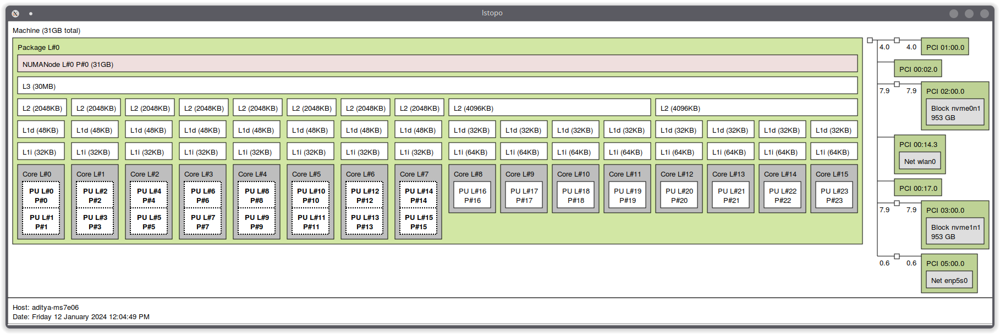
The format above can be a bit confusing due to the default display mode of the indexes. Toggle the display mode using **i** until the legend (at the bottom) shows "Indexes: Physical". The layout should become more clear. In my case it becomes this:
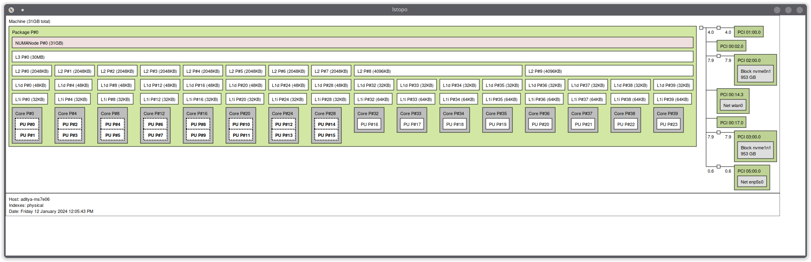
To explain a little bit, I have 16 physical cores 8(P) cores with hyper threading, 8(V) are virtual cores assocaited with p cores and 8E cores (PU P#16 to PU P#23). The 8P+8V cores are mainly divided into eight sets of 2 cores. Each group has its own L2 and L1 cache. However, the most important thing to pay attention here is how virtual cores and P cores are mapped to the physical core. The virtual cores (notated PU P#...) come in pairs of two i.e. *siblings*: 
- PU P#0 and PU P#1 are siblings in Core P#0
- PU P#2 and PU P#3 are siblings in Core P#4
- PU P#4 and PU P#5 are siblings in Core P#8
In your case it might be PU P#0 and PU P#5, so in that case your grouping should take into account the groupings.

When pinning CPUs you should map siblings that are adjacent to each other and have their cached shared for max cache choerency.Here is how i did it for my processor, i leave P1-V1 and P2-V2 and map 6P+6V cores to my VM. 
```XML
<vcpu placement="static">12</vcpu>
  <cputune>
    <vcpupin vcpu="0" cpuset="4"/>
    <vcpupin vcpu="1" cpuset="5"/>
    <vcpupin vcpu="2" cpuset="6"/>
    <vcpupin vcpu="3" cpuset="7"/>
    <vcpupin vcpu="4" cpuset="8"/>
    <vcpupin vcpu="5" cpuset="9"/>
    <vcpupin vcpu="6" cpuset="10"/>
    <vcpupin vcpu="7" cpuset="11"/>
    <vcpupin vcpu="8" cpuset="12"/>
    <vcpupin vcpu="9" cpuset="13"/>
    <vcpupin vcpu="10" cpuset="14"/>
    <vcpupin vcpu="11" cpuset="15"/>
  </cputune>
  <cpu mode="host-passthrough" check="none" migratable="off">
    <topology sockets="1" dies="1" cores="6" threads="2"/>
    <cache mode="passthrough"/>
	// might be needed for AMD systems 
    	<feature policy="require" name="topoext"/>
	//
  </cpu>
```
Hopefully now you have a clear understanding of the methodology behind CPU pinning. 

### 5.3 Iothreads and Iothreadpins

This is important step for increasing IO speed of our SCSI Disk

I build upon CPU pinning using IOthreads and IOthreadpins. According to [documentation](https://libvirt.org/formatdomain.html#iothreads-allocation):
-  *iothreads* specifies the number of threads dedicated to performing block I/O.
-  *iothreadpin* specifies which of host physical CPUs the IOThreads will be pinned to. 
-  *emulatorpin* specifies which of host physical CPUs the "emulator" will be pinned to.

For my CPU, which has a total of 16 cores,  12 cores are already assigned to the guest. Since for my use case I use host for nothing while the guest is running, I decided to use 2 cores for Iothread, and emulator pinning. I intentionally left 2 cores (core 0 an 1) to host, because linux kernel priortises C0 for everything else the host does, and in our setup we have set kernel paramters to priortise interuputs on 1st Core. Im not using my 8E Cores because they are slow and could lead to stutters in VM.

Before the *cputune* element add an *iothreads* element and specify number of io threads. For our use VM we are using SCSI driver which can only use 1 iothread so im specifying only 1. `Refer wiki for more info`
If you have multiple disks you can use multiple io threads one for each drive etc.

Inside the *cpuelement* body, allocate threadpins for each *iothread* you have defined . Here is my configuration for this:

```XML
<vcpu placement="static">12</vcpu>
<iothreads>1</iothreads>
<cputune>
	<vcpupin vcpu="0" cpuset="4"/>
	<vcpupin vcpu="1" cpuset="5"/>
	<vcpupin vcpu="2" cpuset="6"/>
	<vcpupin vcpu="3" cpuset="7"/>
	<vcpupin vcpu="4" cpuset="8"/>
	<vcpupin vcpu="5" cpuset="9"/>
	<vcpupin vcpu="6" cpuset="10"/>
	<vcpupin vcpu="7" cpuset="11"/>
	<vcpupin vcpu="8" cpuset="12"/>
	<vcpupin vcpu="9" cpuset="13"/>
	<vcpupin vcpu="10" cpuset="14"/>
	<vcpupin vcpu="11" cpuset="15"/>
	<emulatorpin cpuset="2-3"/>
	<iothreadpin iothread="1" cpuset="0-3"/>
</cputune>

<cpu mode="host-passthrough" check="none" migratable="off">
    <topology sockets="1" dies="1" cores="6" threads="2"/>
    <cache mode="passthrough"/>
</cpu>
```
>The `cpuset` argument allows u to map multiple cores in serial order. U can also pin multiple cores like `cpuset="3-4,17-20"`

Be careful with this section as you can easily hurt your guest's performance. A safe bet would be not to exhaust your cores. You can read more on this [here](https://mathiashueber.com/performance-tweaks-gaming-on-virtual-machines/).

### 5.4 Disk Performance Tuning using virtio-scsi
So we have been using SCSI disk already but currently its not using the IOThread we defined earlier in CPU Pinning, to do so we need to configure SCSI Controller by adding this `<driver queues="8" iothread="1"/>`

```XML
<devices>
	........
    <disk type="file" device="disk">
      <driver name="qemu" type="qcow2" cache="writeback" io="threads" discard="unmap"/>
      <source file="/var/lib/libvirt/images/win11.qcow2"/>
      <target dev="sdc" bus="scsi"/>
      <boot order="1"/>
      <address type="drive" controller="0" bus="0" target="0" unit="2"/>
    </disk>
	........
    <controller type="scsi" index="0" model="virtio-scsi">
		<driver queues="8" iothread="1"/>
		<address type="pci" domain="0x0000" bus="0x07" slot="0x00" function="0x0"/>
    </controller>
```

### 5.5 CPU Governor And Frequency
By default CPU governor settings are set to mode "powersave", where CPUs boost behaviour is based on the load. This goes a long way in saving power in typical use cases but is bad in the case of a guest OS. Due to the amount of abstraction done in the virtualization proces the guest OS only works with virtual cores assigned it. It therefore can't demand for more *juice* from the host.

The script [cpu_mode_performance.sh](scripts/begin/cpu_mode_performance.sh) set the CPU on the host to "performance" mode whenever the VM is started. Add it to /etc/libvirt/hooks/qemu.d/win10/prepare/begin. 

The script [cpu_mode_powersave.sh](scripts/end/cpu_mode_powersave.sh) reverts the CPUs on the host back to "powersave" whenever the VM is powered off. Add it to /etc/libvirt/hooks/qemu.d/win10/release/end.

#### 5.5.1 Advanced Frequency Settings

Setting up the governor [might not be enough](https://www.reddit.com/r/VFIO/comments/17eqvpo/comment/k6510gf) especially for gaming VMs, so you may want to run the cpu at max frequency when running the VM, i personally like to run all my 8 Cores at max Frequency for gaming VM, 2 of which are with host and 6 are in guest.

Find out your cpu `min` and `max` frequency and save it to `kvm.conf`
```sh
$ cat cat /sys/devices/system/cpu/cpu0/cpufreq/cpuinfo_max_freq  // 5300000

$ cat cat /sys/devices/system/cpu/cpu0/cpufreq/cpuinfo_min_freq  // 800000
```

```sh
# /etc/libvirt/hooks/kvm.conf
CPU_MAX_FREQ=5300000
CPU_MIN_FREQ=800000
```
Then just uncomment the code below method 2 in both [cpu_mode_performance.sh](scripts/begin/cpu_mode_performance.sh), [cpu_mode_powersave.sh](scripts/end/cpu_mode_powersave.sh) and specify cores u want changes to be applied too 

```sh
# method 2

source "/etc/libvirt/hooks/kvm.conf"

for i in {0..15}; do
CPUL=/sys/devices/system/cpu/cpu$i/cpufreq
echo
# cpupower set -c ${i} -g performance --min 5300Mhz --max 5300Mhz example of achiveing the same with some util
# sudo cpufreq-set -c ${i} -g performance --min 5300Mhz --max 5300Mhz;
echo $CPU_MAX_FREQ | tee $CPUL/scaling_min_freq
echo "performance" > $CPUL/scaling_governor;
done
```

While the VM is running you can confirm that the host's CPU is on "performance" mode and current cpu Hz  by running the following command:
```sh
$ cat /sys/devices/system/cpu/cpu0/cpufreq/scaling_governor
$ cat /proc/cpuinfo | grep Hz
```

The output should be the mode the CPU is running on i.e. "performance" and Hz to be whatever u set in CPU_MAX_FREQ if you did set it.

### 5.6 Core Isolation
From [ArchWiki](https://wiki.archlinux.org/title/PCI_passthrough_via_OVMF#Isolating-pinned-CPUs) CPU pinning by itself will not prevent other host processes from running on the pinned CPUs. Properly isolating the pinned CPUs can reduce latency in the guest virtual machine. 

~~I have included scripts for dynamic [core isolation](scripts/begin/isolate-start.sh) and [de isolation](scripts/end/isolate-revert.sh). Paste them to your hooks folder as we have been doing.~~

#### I have now two methods for core-isolation, the new method uses vfio-isolate and is really easy to configure (if u can get it to install properly that is) and then old method that we had before, both are docummneted below.

> To use v1 or v2 method only copy `isolate-start-v2.sh` or `isolate-start-v1.sh` and `isolate-revert-v1.sh` `isolate-revert-v2.sh` in `begin` and `end` folders respectivley

#### V2 
First copy the [`begin`](scripts/begin/isolate-start-v2.sh) and [`end`](scripts/end/isolate-revert-v2.sh) v2 files in your hooks folder

For scripts to work you need to add 4 varaibles to `kvm.conf`

```sh
# isolation V2 (vfio-isolate)
UNDOFILE="/var/run/libvirt/qemu/vfio-isolate-undo.bin"
HCPUS="0-3,16-23"
MCPUS="4-15"
TOTAL_CORES="0-23" ## also used for v1
```
> Explanation: `HCPUS` is cores used by host when VM is on, `MCPUS` is core used by vm. `UNDOFILE` is used by vfisolate to revert changes when VM shutsdown
> In my case i have 24 total cores so total core is 0-23 for me.
>
> For my `VM` im pinning 4-15 cores so that means i will have 0-3 and 16-23 cores left for host so thats whats written here.

#### V1
First copy the [`begin`](scripts/begin/isolate-start-v1.sh) and [`end`](scripts/end/isolate-revert-v1.sh) v1 files in your hooks folder

For scripts to work you need to add 4 varaibles to `kvm.conf`

```sh
# /etc/libvirt/hooks/kvm.conf
TOTAL_CORES='0-23' # total cores in your system
HOST_CORES='0-3,16-23' # cores to be given to host when VM starts   
TOTAL_CORES_MASK=FFFFFF    # bitmask  these are needed to confiugure writeback polciy its all cores with 1s 
HOST_CORES_MASK=F0000F     # bitmask these are needed to confiugure writeback polciy its only Host cores are 1s guest cores are 0
```
> Explanation: In my case i have 24 total cores so total core is 0-23 for me.
>
> For my guest im pinning 4-15 cores so that means i will have 0-3 and 16-23 cores left for host so thats whats written here.

Test core isolation while VM is running
```sh
cat /run/systemd/system.control/user.slice.d/50-AllowedCPUs.conf
```

~~Note: I personally tired core isolation and i had bad time with it so incase it doesnt work for you, remove the script. Other steps are more crucial than isolation specially if you are running only one guest and not doing anything demanding on host~~. Good performance after using vfio-isolate.

### 5.7 Enabling invtsc 
The sections ahead are easier to follow and are minaly configurations for extras.

I came accross this on [reddit](https://www.reddit.com/r/VFIO/comments/asf3tg/drastic_stuttering_reduction_using_invtsc_feature/) and it really helped my performance so i would recommend u try this as well. This might also help hide VM detection

1. Add invtsc ext
```XML
<cpu mode="host-passthrough" check="none" migratable="off">
    <topology sockets="1" dies="1" cores="6" threads="2"/>
    <cache mode="passthrough"/>
  ## Add the line below
	<feature policy="require" name="invtsc"/>
</cpu>
```
2. Clock Settings

```XML
<clock offset="localtime">
    <timer name="rtc" tickpolicy="catchup"/>
    <timer name="pit" tickpolicy="delay"/>
    <timer name="hpet" present="no"/>
    <timer name="kvmclock" present="no"/>
    <timer name="hypervclock" present="yes"/>
</clock>
```

3. Ensure you're using the tsc in Windows: `bcdedit /set useplatformclock true` (in cmd.exe, does not work in PowerShell)

## 6 Hyper-V Enlightenments
I'm utilizing the following Hyper-V enlightments help the Guest OS handle the virtualization tasks. Documentation for what each feature does can be found [here](https://libvirt.org/formatdomain.html#elementsFeatures). 
```XML
    ## Paste it inside <features> block just above
    ...
    <hyperv mode="custom">
      <relaxed state="on"/>
      <vapic state="on"/>
      <spinlocks state="on" retries="8191"/>
      <vpindex state="on"/>
      <synic state="on"/>
      <stimer state="on"/>
      <reset state="on"/>
      <vendor_id state="on" value="whatevervalue"/>
      <frequencies state="on"/>
    </hyperv>
    <kvm>
      <hidden state="on"/>
    </kvm>
    ...
```
The *vendor_id* setting is for going around [the infamous Error 43 error on Nvidia GPUs](https://wiki.archlinux.org/index.php/PCI_passthrough_via_OVMF#%22Error_43:_Driver_failed_to_load%22_on_Nvidia_GPUs_passed_to_Windows_VMs). However, it may also fix some issues with AMD Radeon drivers from version 20.5.1 onwards. The purpose of the *kvm* section (right after the *hyperv* section) is to instruct the kvm to hide its state basically to cheat the guest OS into "thinking" it's on non-virtualized hardware. 

## 7. Rebar Fix on Nvidia GPUs having VRAM >= 24GB

For most part Rebar now works out of the box with kvm but with gpus having 24GB vram (RTX3090, RTX4090) there [could be issues](https://www.reddit.com/r/VFIO/comments/qx4rg7/can_anyone_else_confirm_that_vfio_doesnt_work_w/), related to address spaces, more discussion is on reddit linked post.

Here is how to fix it 

Change the top line of XML from `<domain type='kvm'>` to:

```XML
<domain type='kvm' xmlns:qemu='http://libvirt.org/schemas/domain/qemu/1.0'>
```

And then add the following (after the `</device>` line, before the `</domain>` line):

```XML
<qemu:commandline>
<qemu:arg value='-fw_cfg'/>
<qemu:arg value='opt/ovmf/X-PciMmio64Mb,string=65536'/>
</qemu:commandline>
```

## 8. Software Licensing Considerations

When running in the qemu environment, as described above, unique system identifiers are set by the virtual environment. These identifiers are often used to tie a software license to a physical machine. Because the virtual machine is merely duplicating the physical machine, one can copy the physical system system identifiers into the virtual machine. If one is also using a dedicated physical device for the virtual machine storage, this allows booting the Windows installation as a virtual machine or natively with dual-boot.

To do this, one needs to modify the XML of the virtual machine to replicate their system. An example with some valid values is below:

```XML
<sysinfo type="smbios">
    <bios>
      <entry name="vendor">American Megatrends, Inc.</entry>
      <entry name="version">0812</entry>
      <entry name="date">02/24/2023</entry>
      <entry name="release">8.12</entry>
    </bios>
    <system>
      <entry name="manufacturer">ASUS</entry>
      <entry name="product">System Product Name</entry>
      <entry name="version">System Version</entry>
      <entry name="serial">System Serial Number</entry>
      <entry name="uuid">UNIQUE_UUID</entry>
      <entry name="sku">SKU</entry>
      <entry name="family">To be filled by O.E.M.</entry>
    </system>
    <baseBoard>
      <entry name="manufacturer">ASUSTeK COMPUTER INC.</entry>
      <entry name="product">PRIME Z790-P WIFI</entry>
      <entry name="version">Rev 1.xx</entry>
      <entry name="serial">UNIQUE_SERIAL_NUMBER</entry>
      <entry name="asset">Default string</entry>
    </baseBoard>
</sysinfo>
<os>
    <smbios mode="sysinfo"/>
</os>
```

## Credits:
1. The Arch Wiki for instructions on [how to enable PCI passthrough via OVMF](https://wiki.archlinux.org/index.php/PCI_passthrough_via_OVMF).
2. Wendell from Level1Techs for [the Ryzen GPU Passthrough Setup Guide](https://level1techs.com/article/ryzen-gpu-passthrough-setup-guide-fedora-26-windows-gaming-linux).
3. Bryansteiner (GitHub) for the [GPU passthrough tutorial](https://github.com/bryansteiner/gpu-passthrough-tutorial#considerations).
4. Joeknock90 (Github) for the [single GPU passthrough tutorial](https://github.com/joeknock90/Single-GPU-Passthrough)
5. Mathias Hueber (MathiasHueber.com) for [tips on performance tuning](https://mathiashueber.com/performance-tweaks-gaming-on-virtual-machines/).
6. Risingprismtv (YouTube) for his [video guide on single GPU passthrough for AMD GPUs](https://www.youtube.com/watch?v=3BxAaaRDEEw).
7. Matoking (GitHub) for the [NVIDIA vBIOS Patcher tool](https://github.com/Matoking/NVIDIA-vBIOS-VFIO-Patcher).
8. Reddit user *jibbyjobo* for pointing me to the [CPU Pinning Helper](https://passthroughtools.org/cpupin/).
9. Maagu Karuri VFIO Single GPU Passthrough Guide [Maagu Karuri](https://gitlab.com/Karuri/vfio)

### Enquiries:
If you need help on this subject matter feel free to reach me on Reddit, username *Automatic_Outcome832*. Make sure to follow what is the guide exhaustively before reaching out. 

[//]: # (References)
   [youtube-amd]: <https://www.youtube.com/watch?v=3BxAaaRDEEw>
   [main-wiki]: <https://wiki.archlinux.org/index.php/PCI_passthrough_via_OVMF#Enabling_IOMMU>
   [level1-article]: <https://level1techs.com/article/ryzen-gpu-passthrough-setup-guide-fedora-26-windows-gaming-linux>
   [bransteiner-git]: <https://github.com/bryansteiner/gpu-passthrough-tutorial>
   [libvirt-hooks]: <https://libvirt.org/hooks.html>
   [passthrough-post]: <https://passthroughpo.st/simple-per-vm-libvirt-hooks-with-the-vfio-tools-hook-helper/>
   [actual-vm-setup]: <https://github.com/bryansteiner/gpu-passthrough-tutorial#----part-3-creating-the-vm>
   [nvidia-single-gpu-passthrough]: <https://github.com/joeknock90/Single-GPU-Passthrough#black-screen-on-vm-activation>
   [wiki-hugepages]:<https://wiki.archlinux.org/index.php/KVM#Enabling_huge_pages>


